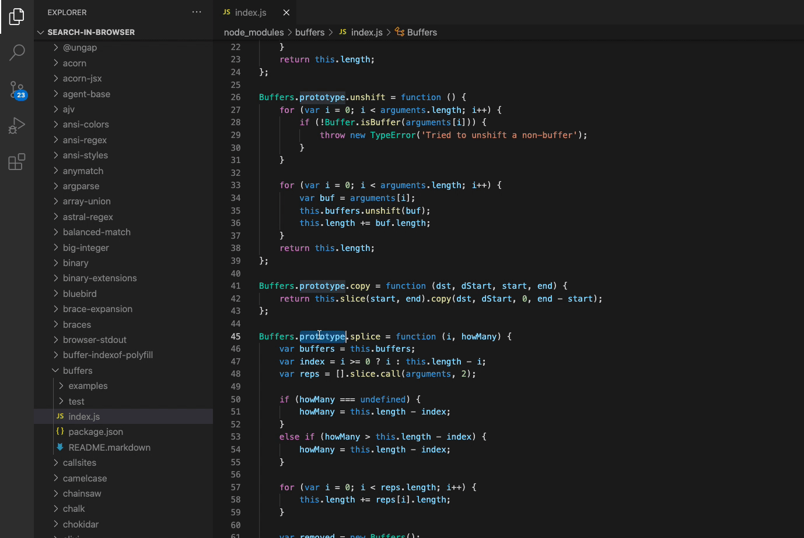
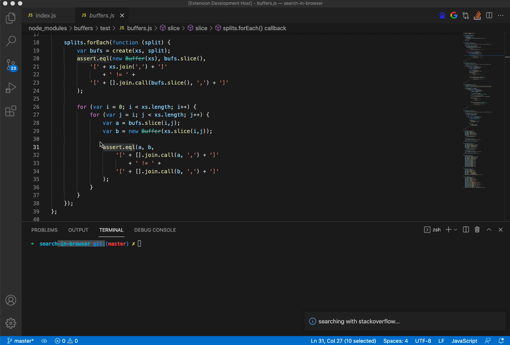

# Search In Browser

[中文介绍](README_chinese.md)

With this extension, you could simply select your code, then right click or click the icon in the upper right corner to search it in your local browser.

[[Current version of Search In Browser]](https://marketplace.visualstudio.com/items?itemName=ZengLi.search-in-browser) [[Downloads]](https://marketplace.visualstudio.com/items?itemName=ZengLi.search-in-browser) [[Rating]](https://marketplace.visualstudio.com/items?itemName=ZengLi.search-in-browser)

<a href="https://marketplace.visualstudio.com/items?itemName=ZengLi.search-in-browser" style="color:#ddd;font-size:10pt;background:#333;padding:10px 14px;border:1px solid #000;">Visit Marketplace</a>

## You can use this extension in two ways.

- Right Click Menu:

- Click the Icon:

Now it has included Google, StackOverflow and Baidu.

## Features

- Quickly search in VSCode without having to copy and paste it into the browser.
- You can choose different ways to search.
- A lightweight extension.

## Release Notes

### 1.0.0

Initial version of the Search In Browser.

### 1.0.1
Update the README file.

-----------------------------------------------------------------------------------------------------------
## Contributions

Star and follow this [public repository](https://github.com/Alex-Sol/search-in-browser) and please provide feedback, submit issues and PRs!

## Tags

`google`, `stackoverflow`, `stack overflow`, `baidu`,   `question`, `answer`, `debug`, `search`, `google`, `instant search`,`browser`,`chrome`,`firefox`,`safari`

**Enjoy It!**

